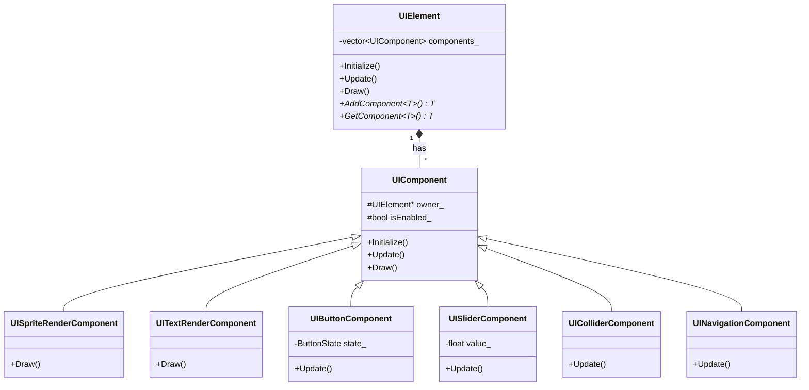

# 設計パターン

## Component パターン（UIシステム）

- [UIElement](Engine/Engine/Features/UI/Element/UIElement.h)
- [UIComponent](Engine/Engine/Features/UI/Component/UIComponent.h)

### 概要

UIの機能をコンポーネントとして分離し、必要な機能を組み合わせてUI要素を構成するパターン。Unityを参考に作成。

### 採用理由

もともとは継承ベースでUI要素を実装していたが、以下の問題が発生した。

- 責任の所在が曖昧で複雑になってきた
- 拡張する際に継承階層が深くなった
- 基底クラスの変更が影響範囲が大きかった

これらの問題を解決するため、機能をコンポーネントとして分離する設計に変更した。

これにより以下を実現した。

- 各コンポーネントが単一の責務を持ち、責任の所在が明確になった
- 新機能はコンポーネントを追加するだけで拡張できるようになった
- 必要な機能を組み合わせて柔軟にUI要素を作成できるようになった

### クラス図

